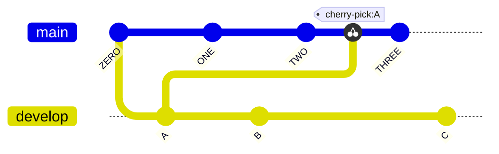
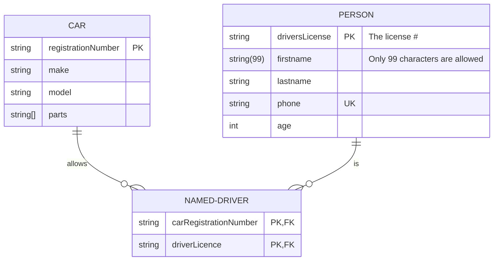
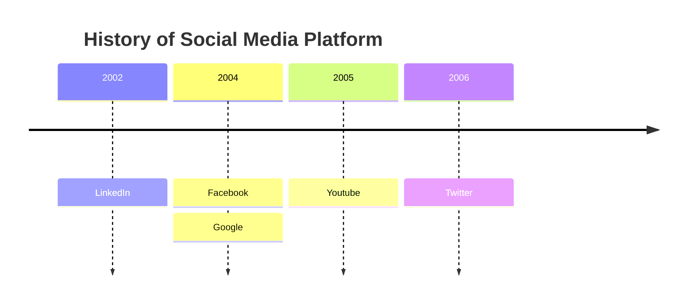
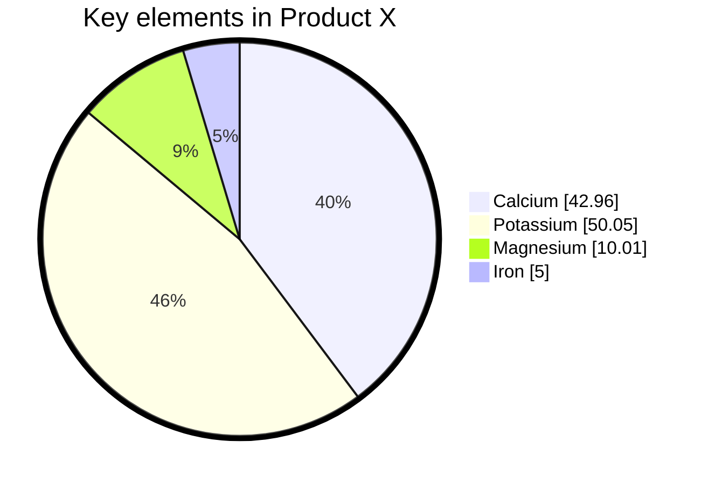
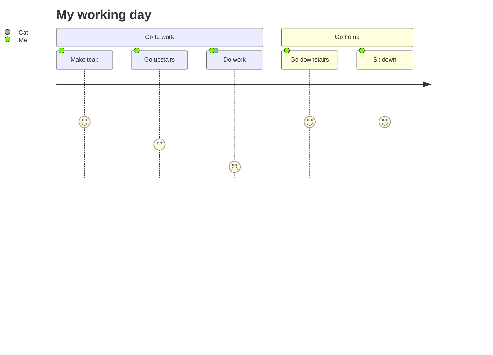
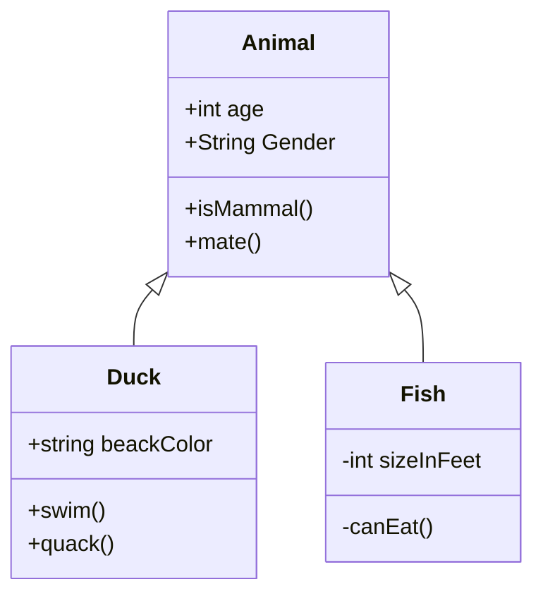
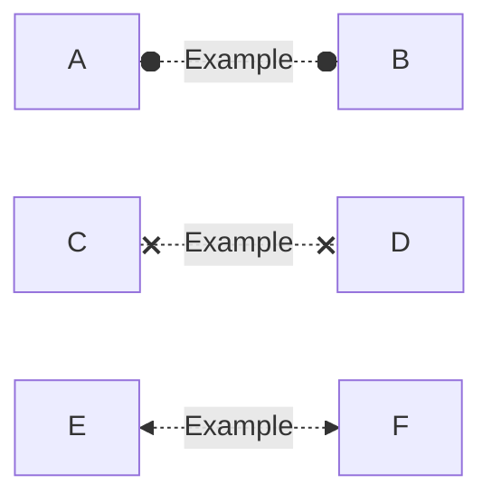

# Changelog

## Version 0.1.1

- Added basic functionality to create a 'gitGraphs'
- Following new functions: 'New-MermaidGitGraph', 'New-MermaidGitGraphEntry' created

## Version 0.1.0

- Added basic functionality to create a 'ERDiagram' (EntityRelationship-Diagram)
- Following new functions: 'New-MermaidERDiagram','New-MermaidERDiagramEntity', 'New-MermaidERDiagramEntityAttribute','New-MermaidERDiagramRelationShip', 'New-MermaidERDiagramRelationShipType' created

## Version 0.0.9

- Added basic functionality to create a 'QuardrantChart'
- Following new functions: 'New-MermaidQuadrantChart','New-MermaidQuadrantChartAxis', 'New-MermaidQuadrantChartDataSet','New-MermaidQuadrantChartQuadrant' created

## Version 0.0.8

- Added basic functionality to create a 'Timeline'
- Following new functions: 'New-MermaidTimeLine','New-MermaidTimelineDataSet', 'New-MermaidTimelineSection','New-MermaidTimelineDirective' created

## Version 0.0.7

- Added basic functionality to create a 'pie chart'
- Following new functions: 'New-MermaidPie','New-MermaidPieDataSet' created

## Version 0.0.6

- Added basic functionality to create a 'userjourney'
- Following new functions: 'New-MermaidJourney','New-MermaidJourneySection','New-MermaidJourneyTask' created

## Version 0.0.5

- Added basic functionality to create ClassDiagrams
- Following new functions: 'New-MermaidClass','New-MermaidClassDiagram','New-MermaidClassMethod','New-MermaidClassProperty','New-MermaidClassRelationShip' created

## Version 0.0.4

### Changes

- Added function 'New-MermaidClassDefinition' to create class definitions to MermaidNodes
- Updated parameter from 'New-MermaidGraph' to accept ClassDefinitions
  
## Version 0.0.3

### Changes

- Added functionality to 'New-MermaidGraphLink' to generate Bidirectional links, added new arrow types (Arrow, Dot and Cross).
  

