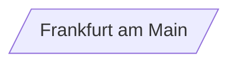
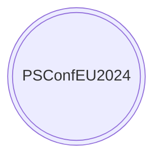
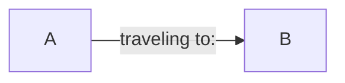
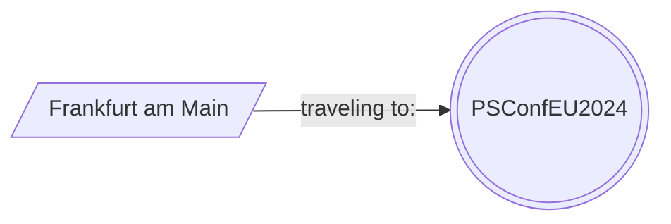
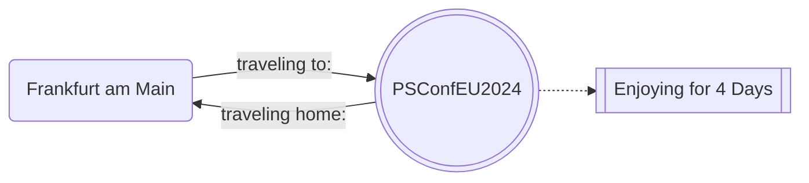

# Examples

## Creating a Node

```powershell
$Node1 = New-MermaidNode -Shape Parallelogram -ID ID1 -Text "Frankfurt am Main"
#   Output: ID1[/Frankfurt am Main/]
```



## Creating another Node

```powershell
$Node2 = New-MermaidNode -Shape DoubleCircle -ID ID2 -Text "PSConfEU$((Get-Date).Year +1)"
#   Output: ID2(((PSConfEU2024)))
```



## Creating a Link

```powershell
$Link = New-MermaidLink -Text "traveling to:" -Linktype ArrowLink
#   Output: -->|traveling to:|
```



## Creating a Connection

```powershell
$Connection = New-MermaidNodeConnection -FirstNode $Node1 -SecondNode $Node2 -Link $Link
#   Output: ID1[/Frankfurt am Main/]-->|traveling to:|ID2(((PSConfEU2024)))
```



## Creating a Graph

```powershell
$Graph = New-MermaidGraph -Direction LR -NodeConnections $Connection
<#  Outpout:
        \`\`\`mermaid
        graph LR
                ID1[/Frankfurt am Main/]-->|traveling to:|ID2(((PSConfEU2024)))
        \`\`\`
#>
```


## Creating another Graph in one big step

```powershell
New-MermaidGraph -Direction LR -NodeConnections @(
    $(
        $newMermaidNodeConnectionSplat = @{
            FirstNode = $(New-MermaidNode -Shape RoundEdges -ID ID1 -Text "Frankfurt am Main")
            SecondNode = $(New-MermaidNode -Shape DoubleCircle -ID ID2 -Text "PSConfEU$((Get-Date).Year +1)")
            Link = $(New-MermaidLink -Text "traveling to:" -Linktype ArrowLink)
        }
        New-MermaidNodeConnection @newMermaidNodeConnectionSplat
    ),
    $(
        $newMermaidNodeConnectionSplat = @{
            FirstNode = $(New-MermaidNode -Shape DoubleCircle -ID ID2 -Text "PSConfEU$((Get-Date).Year +1)")
            SecondNode = $(New-MermaidNode -Shape subroutine -ID ID3 -Text "Enjoying for 4 Days")
            Link = $(New-MermaidLink -Linktype DottedLink)
        }
        New-MermaidNodeConnection @newMermaidNodeConnectionSplat
    ),
    $(
        $newMermaidNodeConnectionSplat = @{
            FirstNode = $(New-MermaidNode -Shape DoubleCircle -ID ID2 -Text "PSConfEU$((Get-Date).Year +1)")
            SecondNode = $(New-MermaidNode -Shape RoundEdges -ID ID1 -Text "Frankfurt am Main")
            Link = $(New-MermaidLink -Text "traveling home:" -Linktype ArrowLink)
        }
        New-MermaidNodeConnection @newMermaidNodeConnectionSplat
    )
)
<# Outpout:
\`\`\`mermaid
graph LR
        ID1(Frankfurt am Main)-->|traveling to:|ID2(((PSConfEU2024)))
        ID2(((PSConfEU2024)))-.->ID3[[Enjoying for 4 Days]]
        ID2(((PSConfEU2024)))-->|traveling home:|ID1(Frankfurt am Main)
\`\`\`
#>
```


