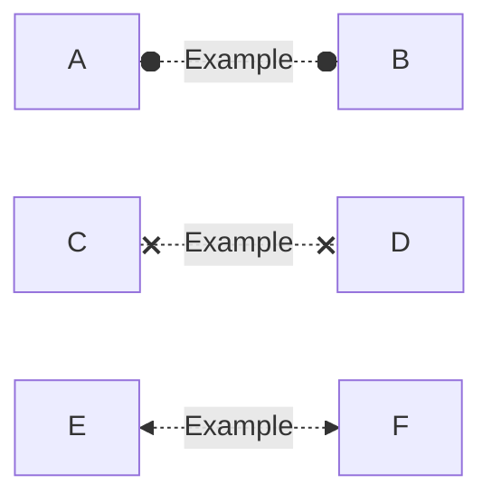

# PSMermaid

Easily Create Mermaid Markdown Files in PowerShell
A large list with examples you can find [here](https://github.com/HCRitter/PSMermaid/blob/main/EXAMPLES.md), the full changelog you can find [here](https://github.com/HCRitter/PSMermaid/blob/main/CHANGELOG.md).

## Changelog

Version 0.0.3

### Changes

- Added functionality to 'New-MermaidLink' to generate Bidirectional links, added new arrow types (Arrow, Dot and Cross).
  


## Examples

### Creating a Graph in one big step

```powershell
New-MermaidGraph -Direction LR -NodeConnections @(
    $(
        $newMermaidNodeConnectionSplat = @{
            FirstNode = $(New-MermaidNode -Shape RoundEdges -ID ID1 -Text "Frankfurt am Main" -Class "Starter")
            SecondNode = $(New-MermaidNode -Shape DoubleCircle -ID ID2 -Text "PSConfEU$((Get-Date).Year +1)")
            Link = $(New-MermaidLink -Text "traveling to:" -Linktype Link -ArrowType Cross) 
        }
        New-MermaidNodeConnection @newMermaidNodeConnectionSplat
    ),
    $(
        $newMermaidNodeConnectionSplat = @{
            FirstNode = $(New-MermaidNode -Shape DoubleCircle -ID ID2 -Text "PSConfEU$((Get-Date).Year +1)")
            SecondNode = $(New-MermaidNode -Shape subroutine -ID ID3 -Text "Enjoying for 4 Days")
            Link = $(New-MermaidLink -Linktype Dotted -ArrowType Arrow -BiDirectional)
        }
        New-MermaidNodeConnection @newMermaidNodeConnectionSplat
    ),
    $(
        $newMermaidNodeConnectionSplat = @{
            FirstNode = $(New-MermaidNode -Shape DoubleCircle -ID ID2 -Text "PSConfEU$((Get-Date).Year +1)")
            SecondNode = $(New-MermaidNode -Shape RoundEdges -ID ID1 -Text "Frankfurt am Main")
            Link = $(New-MermaidLink -Text "traveling home:" -Linktype Link -ArrowType Dot)
        }
        New-MermaidNodeConnection @newMermaidNodeConnectionSplat
    )
) -ClassDefinitions @(
    New-MermaidClassDefinition -Name "Starter" -FillColor "#6699ff" -StrokeColor "#999966"
)
<# Outpout:
```mermaid
graph LR
        ID1("Frankfurt am Main"):::Starter---x|traveling to:|ID2(((PSConfEU2024)))
        ID2(((PSConfEU2024)))<.->ID3[[Enjoying for 4 Days]]
        ID2(((PSConfEU2024)))---o|traveling home:|ID1(Frankfurt am Main)
        classDef Starter fill:#6699ff,stroke:#999966,stroke-width:2px
```mermaid
#>
```


