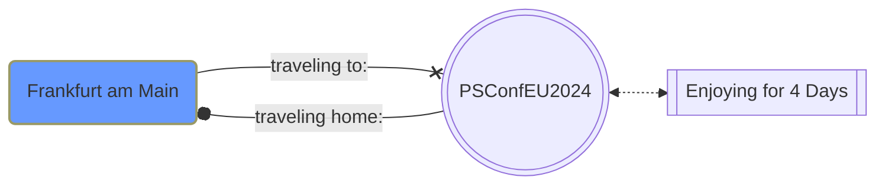
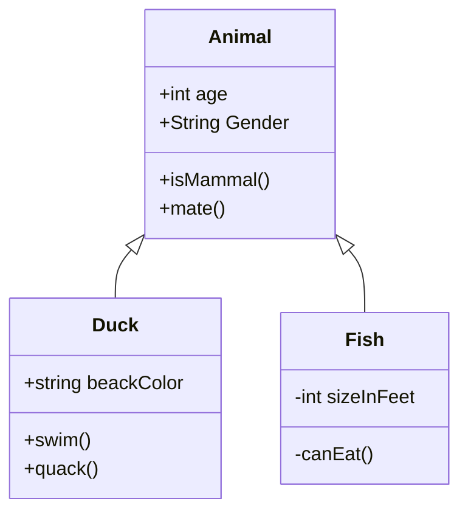

# PSMermaid

Easily Create Mermaid Markdown Files in PowerShell
A large list with examples you can find [here](https://github.com/HCRitter/PSMermaid/blob/main/EXAMPLES.md), the full changelog you can find [here](https://github.com/HCRitter/PSMermaid/blob/main/CHANGELOG.md).

## Changelog

Version 0.0.5

### Changes

- Added basic functionality to create ClassDiagrams
- Following new functions: 'New-MermaidClass','New-MermaidClassDiagram','New-MermaidClassMethod','New-MermaidClassProperty','New-MermaidClassRelationShip' created

Version 0.0.4

### Changes

- Added function 'New-MermaidClassDefinition' to create class definitions to MermaidNodes
- Updated parameter from 'New-MermaidGraph' to accept ClassDefinitions

## Examples

### Creating a Graph in one big step

```powershell
New-MermaidGraph -Direction LR -NodeConnections @(
    $(
        $newMermaidNodeConnectionSplat = @{
            FirstNode = $(New-MermaidNode -Shape RoundEdges -ID ID1 -Text "Frankfurt am Main" -Class "Starter")
            SecondNode = $(New-MermaidNode -Shape DoubleCircle -ID ID2 -Text "PSConfEU$((Get-Date).Year +1)")
            Link = $(New-MermaidLink -Text "traveling to:" -Linktype Link -ArrowType Cross) 
        }
        New-MermaidNodeConnection @newMermaidNodeConnectionSplat
    ),
    $(
        $newMermaidNodeConnectionSplat = @{
            FirstNode = $(New-MermaidNode -Shape DoubleCircle -ID ID2 -Text "PSConfEU$((Get-Date).Year +1)")
            SecondNode = $(New-MermaidNode -Shape subroutine -ID ID3 -Text "Enjoying for 4 Days")
            Link = $(New-MermaidLink -Linktype Dotted -ArrowType Arrow -BiDirectional)
        }
        New-MermaidNodeConnection @newMermaidNodeConnectionSplat
    ),
    $(
        $newMermaidNodeConnectionSplat = @{
            FirstNode = $(New-MermaidNode -Shape DoubleCircle -ID ID2 -Text "PSConfEU$((Get-Date).Year +1)")
            SecondNode = $(New-MermaidNode -Shape RoundEdges -ID ID1 -Text "Frankfurt am Main")
            Link = $(New-MermaidLink -Text "traveling home:" -Linktype Link -ArrowType Dot)
        }
        New-MermaidNodeConnection @newMermaidNodeConnectionSplat
    )
) -ClassDefinitions @(
    New-MermaidClassDefinition -Name "Starter" -FillColor "#6699ff" -StrokeColor "#999966"
)
```



### Creating a classDiagram in one big step

```powershell
$newMermaidClassDiagramSplat = @{
    Class = @(
        $(
            $newMermaidClassSplat = @{
                Name = 'Animal'
                property = @(
                    $(
                        $newmermaidclasspropertySplat = @{
                            Accessability = 'Public'
                            Name = 'age'
                            Datatype = 'int'
                        }
                        new-mermaidclassproperty @newmermaidclasspropertySplat
                    ),
                    $(
                        $newmermaidclasspropertySplat = @{
                            Accessability = 'Public'
                            Name = 'Gender'
                            Datatype = 'String'
                        }
                        new-mermaidclassproperty @newmermaidclasspropertySplat
                    )
                )
                Method = @(
                    $(
                        $newMermaidClassMethodSplat = @{
                            Encapsulation = 'Public'
                            Name = 'isMammal'
                        }
                        New-MermaidClassMethod @newMermaidClassMethodSplat 
                    ),
                    $(
                        $newMermaidClassMethodSplat = @{
                            Encapsulation = 'Public'
                            Name = 'mate'
                        }
                        New-MermaidClassMethod @newMermaidClassMethodSplat
                    )
                )
            }
            New-MermaidClass @newMermaidClassSplat
        ),
        $(
            $newMermaidClassSplat = @{
                Name = 'Fish'
                property = @(
                    $(
                        $newmermaidclasspropertySplat = @{
                            Accessability = 'Private'
                            Name = 'sizeInFeet'
                            Datatype = 'int'
                        }
                        new-mermaidclassproperty @newmermaidclasspropertySplat
                    )
                )
                Method = @(
                    $(
                        $newMermaidClassMethodSplat = @{
                            Encapsulation = 'Private'
                            Name = 'canEat'
                        }
                        New-MermaidClassMethod @newMermaidClassMethodSplat 
                    )
                )
            }
            New-MermaidClass @newMermaidClassSplat
        ),
        $(
            $newMermaidClassSplat = @{
                Name = 'Duck'
                property = @(
                    $(
                        $newmermaidclasspropertySplat = @{
                            Accessability = 'Public'
                            Name = 'beackColor'
                            Datatype = 'string'
                        }
                        new-mermaidclassproperty @newmermaidclasspropertySplat
                    )
                )
                Method = @(
                    $(
                        $newMermaidClassMethodSplat = @{
                            Encapsulation = 'Public'
                            Name = 'swim'
                        }
                        New-MermaidClassMethod @newMermaidClassMethodSplat 
                    ),
                    $(
                        $newMermaidClassMethodSplat = @{
                            Encapsulation = 'Public'
                            Name = 'quack'
                        }
                        New-MermaidClassMethod @newMermaidClassMethodSplat
                    )
                )
            }
            New-MermaidClass @newMermaidClassSplat
        )
    )
    RelationShip = @(
        $(
            $newMermaidClassRelationShipSplat = @{
                RelationShipType = 'Inheritance'
                FirstClass = 'Animal'
                SecondClass = 'Duck'
            }

            New-MermaidClassRelationShip @newMermaidClassRelationShipSplat
        ),
        $(
            $newMermaidClassRelationShipSplat = @{
                RelationShipType = 'Inheritance'
                FirstClass = 'Animal'
                SecondClass = 'Fish'
            }

            New-MermaidClassRelationShip @newMermaidClassRelationShipSplat
        )
    )
}

New-MermaidClassDiagram @newMermaidClassDiagramSplat
```


