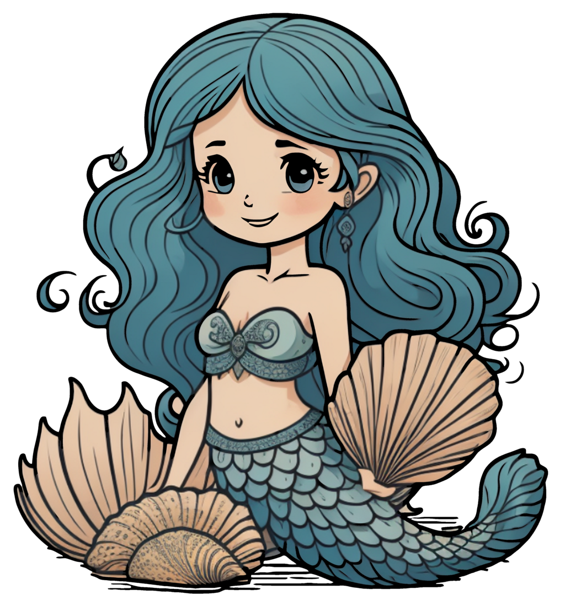

# PSMermaid



Easily Create Mermaid Markdown Files in PowerShell

A large list with examples you can find [here](https://github.com/HCRitter/PSMermaid/blob/main/EXAMPLES.md).

The full changelog you can find [here](https://github.com/HCRitter/PSMermaid/blob/main/CHANGELOG.md).

## Implementation overview

- [x] Graph / FlowChart
- [x] Class Diagram
- [x] User Journey
- [x] Pie Chart
- [x] Timeline
- [ ] Sequence Diagram
- [ ] State Diagram
- [ ] Entity Relationship Diagrams
- [ ] Beta Testing
- [ ] Gantt
- [ ] Quadrant Chart
- [ ] Requirement Diagram

## Changelog

### Version 0.0.8

#### Changes

- Added basic functionality to create a 'Timeline'
- Following new functions: 'New-MermaidTimeLine','New-MermaidTimelineDataSet', 'New-MermaidTimelineSection','New-MermaidTimelineDirective' created

### Version 0.0.7

#### Changes

- Added basic functionality to create a 'pie chart'
- Following new functions: 'New-MermaidPie','New-MermaidPieDataSet' created
  
### Version 0.0.6

#### Changes

- Added basic functionality to create a 'userjourney'
- Following new functions: 'New-MermaidJourney','New-MermaidJourneySection','New-MermaidJourneyTask' created
  
### Version 0.0.5

#### Changes

- Added basic functionality to create ClassDiagrams
- Following new functions: 'New-MermaidClass','New-MermaidClassDiagram','New-MermaidClassMethod','New-MermaidClassProperty','New-MermaidClassRelationShip' created

## Examples

### Creating a Graph in one big step

```powershell
New-MermaidGraph -Direction LR -NodeConnections @(
    $(
        $newMermaidNodeConnectionSplat = @{
            FirstNode = $(New-MermaidGraphNode -Shape RoundEdges -ID ID1 -Text "Frankfurt am Main" -Class "Starter")
            SecondNode = $(New-MermaidGraphNode -Shape DoubleCircle -ID ID2 -Text "PSConfEU$((Get-Date).Year +1)")
            Link = $(New-MermaidGraphLink -Text "traveling to:" -Linktype Link -ArrowType Cross) 
        }
        New-MermaidGraphNodeConnection @newMermaidNodeConnectionSplat
    ),
    $(
        $newMermaidNodeConnectionSplat = @{
            FirstNode = $(New-MermaidGraphNode -Shape DoubleCircle -ID ID2 -Text "PSConfEU$((Get-Date).Year +1)")
            SecondNode = $(New-MermaidGraphNode -Shape subroutine -ID ID3 -Text "Enjoying for 4 Days")
            Link = $(New-MermaidGraphLink -Linktype Dotted -ArrowType Arrow -BiDirectional)
        }
        New-MermaidGraphNodeConnection @newMermaidNodeConnectionSplat
    ),
    $(
        $newMermaidNodeConnectionSplat = @{
            FirstNode = $(New-MermaidGraphNode -Shape DoubleCircle -ID ID2 -Text "PSConfEU$((Get-Date).Year +1)")
            SecondNode = $(New-MermaidGraphNode -Shape RoundEdges -ID ID1 -Text "Frankfurt am Main")
            Link = $(New-MermaidGraphLink -Text "traveling home:" -Linktype Link -ArrowType Dot)
        }
        New-MermaidGraphNodeConnection @newMermaidNodeConnectionSplat
    )
) -ClassDefinitions @(
    New-MermaidGraphStyleClassDefinition -Name "Starter" -FillColor "#6699ff" -StrokeColor "#999966"
)
```


### Creating a classDiagram in one big step

```powershell
$newMermaidClassDiagramSplat = @{
    Class = @(
        $(
            $newMermaidClassSplat = @{
                Name = 'Animal'
                property = @(
                    $(
                        $newmermaidclasspropertySplat = @{
                            Accessability = 'Public'
                            Name = 'age'
                            Datatype = 'int'
                        }
                        new-mermaidclassproperty @newmermaidclasspropertySplat
                    ),
                    $(
                        $newmermaidclasspropertySplat = @{
                            Accessability = 'Public'
                            Name = 'Gender'
                            Datatype = 'String'
                        }
                        new-mermaidclassproperty @newmermaidclasspropertySplat
                    )
                )
                Method = @(
                    $(
                        $newMermaidClassMethodSplat = @{
                            Encapsulation = 'Public'
                            Name = 'isMammal'
                        }
                        New-MermaidClassMethod @newMermaidClassMethodSplat 
                    ),
                    $(
                        $newMermaidClassMethodSplat = @{
                            Encapsulation = 'Public'
                            Name = 'mate'
                        }
                        New-MermaidClassMethod @newMermaidClassMethodSplat
                    )
                )
            }
            New-MermaidClass @newMermaidClassSplat
        ),
        $(
            $newMermaidClassSplat = @{
                Name = 'Fish'
                property = @(
                    $(
                        $newmermaidclasspropertySplat = @{
                            Accessability = 'Private'
                            Name = 'sizeInFeet'
                            Datatype = 'int'
                        }
                        new-mermaidclassproperty @newmermaidclasspropertySplat
                    )
                )
                Method = @(
                    $(
                        $newMermaidClassMethodSplat = @{
                            Encapsulation = 'Private'
                            Name = 'canEat'
                        }
                        New-MermaidClassMethod @newMermaidClassMethodSplat 
                    )
                )
            }
            New-MermaidClass @newMermaidClassSplat
        ),
        $(
            $newMermaidClassSplat = @{
                Name = 'Duck'
                property = @(
                    $(
                        $newmermaidclasspropertySplat = @{
                            Accessability = 'Public'
                            Name = 'beackColor'
                            Datatype = 'string'
                        }
                        new-mermaidclassproperty @newmermaidclasspropertySplat
                    )
                )
                Method = @(
                    $(
                        $newMermaidClassMethodSplat = @{
                            Encapsulation = 'Public'
                            Name = 'swim'
                        }
                        New-MermaidClassMethod @newMermaidClassMethodSplat 
                    ),
                    $(
                        $newMermaidClassMethodSplat = @{
                            Encapsulation = 'Public'
                            Name = 'quack'
                        }
                        New-MermaidClassMethod @newMermaidClassMethodSplat
                    )
                )
            }
            New-MermaidClass @newMermaidClassSplat
        )
    )
    RelationShip = @(
        $(
            $newMermaidClassRelationShipSplat = @{
                RelationShipType = 'Inheritance'
                FirstClass = 'Animal'
                SecondClass = 'Duck'
            }

            New-MermaidClassRelationShip @newMermaidClassRelationShipSplat
        ),
        $(
            $newMermaidClassRelationShipSplat = @{
                RelationShipType = 'Inheritance'
                FirstClass = 'Animal'
                SecondClass = 'Fish'
            }

            New-MermaidClassRelationShip @newMermaidClassRelationShipSplat
        )
    )
}

New-MermaidClassDiagram @newMermaidClassDiagramSplat
```


### Creating a UserJourney in one big step

```powershell
New-MermaidJourney -Title "My working day" -Section @(
    $(
        New-MermaidJourneySection -Title "Go to work" -Task @(
            $(
                New-MermaidJourneyTask -Name "Make teak" -Score 5 -Actor @("Me")
            ),
            $(
                New-MermaidJourneyTask -Name "Go upstairs" -Score 3 -Actor @("Me")
            ),
            $(
                New-MermaidJourneyTask -Name "Do work" -Score 1 -Actor @("Me, Cat")
            )
        )
    ),
    $(
        New-MermaidJourneySection -Title "Go home" -Task @(
            $(
                New-MermaidJourneyTask -Name "Go downstairs" -Score 5 -Actor @("Me")
            ),
            $(
                New-MermaidJourneyTask -Name "Sit down" -Score 5 -Actor @("Me")
            )
        )
    )
)
```


### Creating a Pie Chart in one big step

```powershell
New-MermaidPie -Title "Key elements in Product X" -ShowData -DataSet @(
    $(
        New-MermaidPieDataSet -Name Calcium -Value 42.96
    ),
    $(
        New-MermaidPieDataSet -Name Potassium -Value 50.05
    ),
    $(
        New-MermaidPieDataSet -Name Magnesium -Value 10.01
    ),
    $(
        New-MermaidPieDataSet -Name Iron -Value 5
    )
)
```


### Creating a Time in one big step

```powershell
New-MermaidTimeline -Title "England's History Timeline" -Section @(
    $(New-MermaidTimelineSection -Name "Stone Age" -DataSet @(
        $(New-MermaidTimelineDataSet -TimePeriod "7600 BC" -Events "Britain's oldest known house was built in Orkney, Scotland"),
        $(New-MermaidTimelineDataSet -TimePeriod "6000 BC" -Events "Sea levels rise and Britain becomes an island.<br> The people who live here are hunter-gatherers.")
    )),
    $(New-MermaidTimelineSection -Name "Bronze Age" -DataSet @(
        $(New-MermaidTimelineDataSet -TimePeriod "2300 BC" -Events @("People arrive from Europe and settle in Britain. <br>They bring farming and metalworking.","New styles of pottery and ways of burying the dead appear.")),
        $(New-MermaidTimelineDataSet -TimePeriod "2200 BC" -Events @("The last major building works are completed at Stonehenge.<br> People now bury their dead in stone circles.","The first metal objects are made in Britain.Some other nice things happen. it is a good time to be alive."))
    ))
)
```


